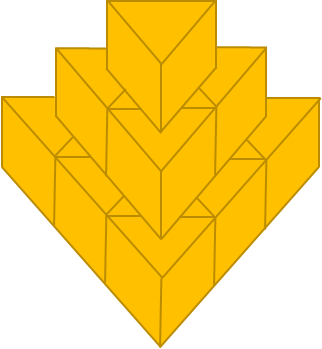

# ENGR 102 Lab Topic 6 (optional)

## Activities
This **optional** lab consists of three activities. Please submit the following files to Gradescope.

1. [Triangle Pyramid Area](#triangle-pyramid-area)
2. [Collatz Conjecture](#collatz-conjecture)
3. [Balancing Numbers](#balancing-numbers)

## Triangle Pyramid Area
An ancient ruler has decided to build a Geometry Temple in the form of a triangle-base pyramid made up of triangular prisms with a given side (as illustrated below). The top and bottom of each prism is an equilateral triangle with the height of the prism equal to one side of the triangle. The Temple has `n` layers, where the bottom layer forms an equilateral triangle with a side length of `n` prisms, and the top layer is a single triangular prism. The ancient ruler wants the surface of the Temple to be covered with gold. *What is the total area of gold foil that is needed in order to accomplish this?*



Write a program named `tpyramid_area1.py` that will ask the user to input the length of one side of a triangular prism (in meters) and the number of layers of the pyramid. Have your program calculate the total area of gold foil that is needed to cover the visible top and sides of the pyramid. Your program **must** use a loop, however you may **NOT** use lists, tuples, or dictionaries.

Now write a second program named `tpyramid_area2.py` that performs the same calculation – but this time without a loop (hint: arithmetic progression).

Example output (using inputs `1`, `5`):
```
Enter the side length in meters: 1
Enter the number of layers: 5
You need 55.83 m^2 of gold foil to cover the pyramid
```

**Note:** Both programs should yield the same output!


## Collatz Conjecture
The Collatz conjecture, also known as the `3n + 1` conjecture (and other names), deals with the following operation to produce a sequence of numbers. Given a number, `n`, if `n` is even then the next number is `n` divided by 2. If `n` is odd, then the next number is `3n + 1`. The Collatz conjecture is that this sequence of numbers always eventually reaches 1. As simple as this seems, it is unproven (and considered extremely hard to prove) by mathematicians.

Write a program named `collatz_conjecture.py` that takes as input from the user a positive integer and computes the Collatz sequence, printing out all of the numbers in the sequence, followed by a line stating how many iterations it took to reach the value 1. Format your output as shown below.

Example output (using input `6`):
```
Enter an integer: 6
Here is the Collatz sequence starting at 6:
6, 3, 10, 5, 16, 8, 4, 2, 1
It took 8 iterations to reach 1
```

## Balancing Numbers
Write a program named `balancing_numbers.py` that takes in an integer value `n` from the user and determines if it is a balancing number. If `n` is a balancing number, output the corresponding value of `r`. Do **NOT** use any containers like lists, tuples, sets, and dictionaries, or the `sum()` function.

A positive number `n` is a balancing number if the sum of numbers from `1` to `n − 1` is equal to the sum of numbers `n + 1` to `n + r` where `r` is a positive integer. For example, 6 is a balancing number with `r` of 2. That means the numbers 1 through 5 sum to the same amount as the next two integers after 6 (7 and 8). In other words, `1+2+3+4+5=7+8`.

Example output (using input `6`):
```
Enter a value for n: 6
6 is a balancing number with r=2
```

Example output (using input `102`):
```
Enter a value for n: 102
102 is not a balancing number
```

Revised Summer 2026 SNR
